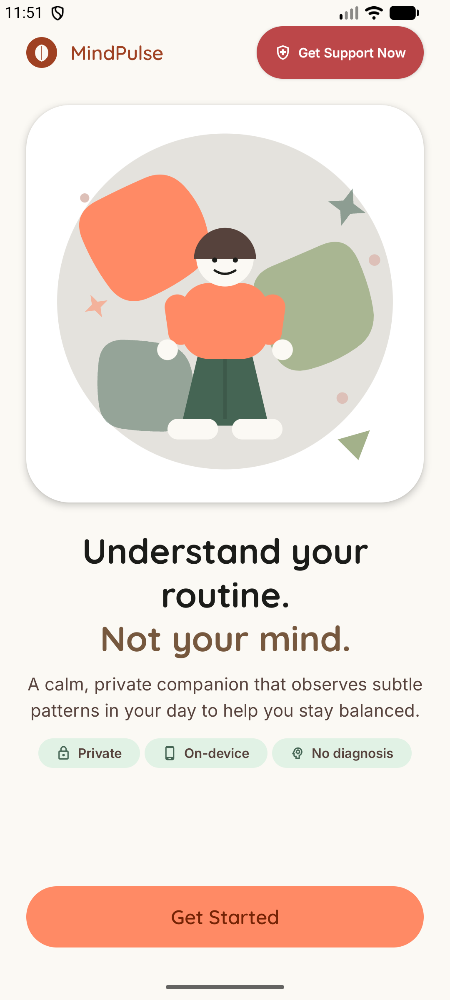
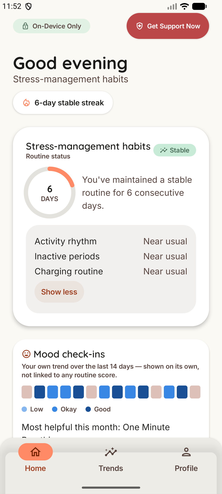
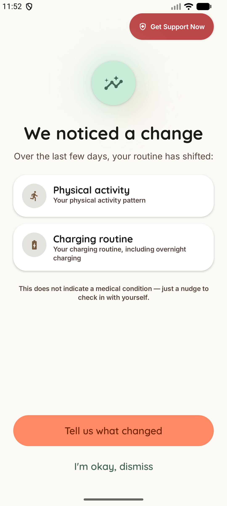
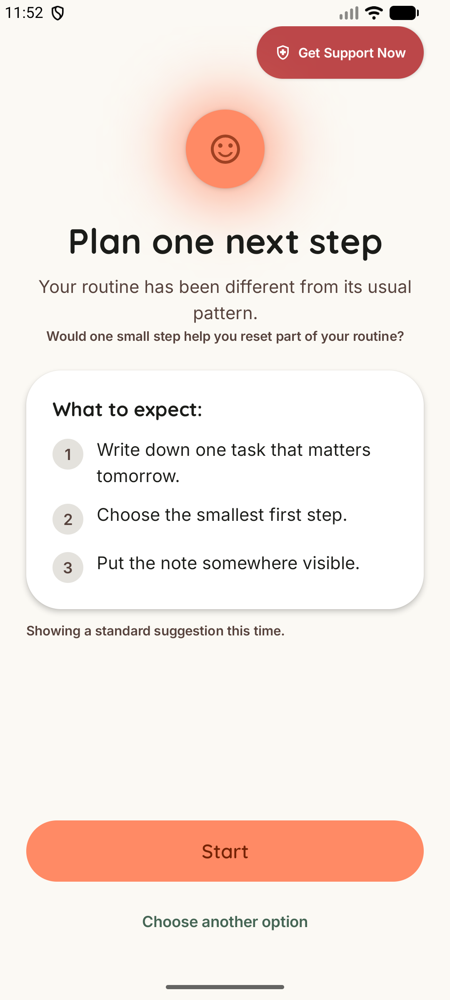
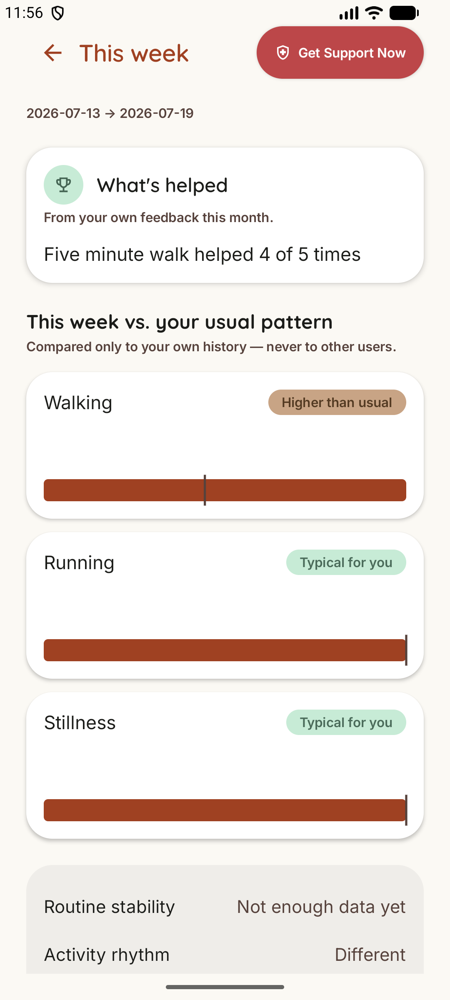

# MindPulse


<p align="center">
  
  
  
  
  
</p>

A privacy-first Android application that combines smartphone behavioural
sensing, personalized temporal modelling, and a fine-tuned on-device
language model to detect sustained routine changes and offer
evidence-grounded micro-interventions — entirely on-device, no cloud
inference, ever.

MindPulse is a routine-change and wellbeing-support tool. It is **not** a
diagnostic system, therapist, medical device, or emergency service. It
never claims to know why a routine changed — only that it did, and for
how long.

This repository is the end-to-end ML pipeline: real data, real training,
real evaluation, real on-device conversion. The Android app is built and
maintained in a separate project and is summarized below.

## Status

Portfolio / research build, not on the Play Store. The Python ML pipeline
(data audit → feature pipeline → baselines → behaviour encoder → LLM SFT
dataset → LoRA fine-tune → LiteRT-LM conversion) is complete, tested, and
verified end to end — real bugs were found and fixed at nearly every
stage, documented honestly below rather than smoothed over. The Android
app is fully built (11 screens, real background sensing, on-device
inference) and verified on both emulator and real physical hardware.

## Repository layout

```
data/schemas/     real JSON schema contracts (daily features, LLM I/O)
ml/behaviour/      StudentLife-trained temporal behaviour encoder
                    (PyTorch -> Keras weight-port -> TFLite)
ml/llm/            Gemma 3 270M IT LoRA fine-tune
                    (Transformers/PEFT/TRL -> LiteRT-LM)
```

`data/raw/`, `data/interim/`, `data/processed/` and all model weight
files (`.tflite`, `.litertlm`, checkpoints, LoRA adapters) are git-ignored
and never committed — see `.gitignore`. The Android app itself lives in a
separate project, not a subdirectory of this repo.

---

## The behaviour model

A temporal convolutional network (TCN) that learns a personal behavioural
baseline from three passively-sensed signal groups — movement, phone
lock/screen rhythm, and charging pattern — and embeds a rolling 7-day
window into an 8-dimensional representation compared only against the
individual's own history.

**Data**: [StudentLife](https://studentlife.cs.dartmouth.edu/) (Dartmouth),
49 real participants. The official host was unreachable when this project
was built (confirmed independently via `curl`, `WebFetch`, and Python
`requests`) — `src/download_data.py` includes a documented, tested
fallback via a Kaggle mirror, exercised end-to-end (49/49 real participant
files extracted correctly).

**Feature pipeline**: 12 daily features (activity fractions, phone-lock
session stats, charging session stats, overnight-charge overlap) + 12
matching missingness flags, day-major flattened into a `[7, 24]` window
per 7-day sequence. A real bug — overlapping raw phonelock/phonecharge
intervals producing >24h daily totals — was found and fixed via interval
merging.

**Baselines**: 4 required baseline models, evaluated with GroupKFold
(participant-grouped) to prevent identity leakage — all performed near
chance, motivating the encoder approach.

**Encoder training**: causal dilated Conv1D TCN, masked MSE
reconstruction loss. A real training-instability bug (embedding
magnitudes diverging to ~1e8) was root-caused via a weight-port numerical
verification test and fixed with gradient clipping (`max_norm=1.0`),
reducing the Python-vs-exported numerical diff from 6.0 to 1.9×10⁻⁶.

**Evaluation**: Leave-one-participant-out (LOSO) cross-validation against
same-day self-reported stress. Real, honestly-reported result: **AUC =
0.5017, p = 0.82** — statistically indistinguishable from chance. This is
disclosed deliberately, not hidden: the product's actual safety net is
persistence (3+ consecutive days) and agreement across 2+ independent
signal groups compared to a personal 14-day median/MAD baseline — not the
raw embedding score in isolation.

**Export**: fp32 TFLite, 22,872 bytes — ships in the app. A full-integer
calibrated INT8 quantization attempt hit a genuine `TFLiteConverter` bug
(constant all-zero output); dynamic-range quantization worked correctly
but only reached 95.9% output agreement with fp32, below the 99% bar —
documented as a permanent, accepted limitation. fp32 ships instead.

**Alert logic** (real thresholds, not re-derivable from guessing):
14-day baseline window, 60% minimum day-coverage, 95th-percentile drift
threshold, 3+ consecutive days persistence, 2+ signal groups required to
agree, 7-day cooldown after surfacing a change.

## The language model

Gemma 3 270M IT, LoRA fine-tuned (rank 16, targeting
`q/k/v/o_proj` + `gate/up/down_proj`), converted to LiteRT-LM for fully
on-device inference — no cloud call, ever, after the one-time model
download.

**SFT dataset**: 4,589 examples built from EmpatheticDialogues (CC
BY-NC 4.0) + ESConv (academic research use) + generated product-specific
scenarios, filtered and validated. Real bugs found and fixed: a role-name
bug (`"model"` used instead of Gemma's expected `"assistant"`, caught via
the real tokenizer, not a mock) and a `apply_chat_template(tokenize=True)`
`BatchEncoding` length bug that silently corrupted prompt/label masking.

**Training**: real GPU run (RTX 4060 Laptop, 8.6GB VRAM, WSL2 — CUDA
passthrough required since `ai-edge-torch`/`litert-torch` have no native
Windows support). Batch size reduced to 1 (grad-accum 32) after a real
CUDA OOM from the model's 262,144-token vocabulary. 318 steps, 42:49,
loss 0.230 → 0.083.

**Evaluation** — real, batched inference (rewritten from an initial
unbatched pass that used only 25% GPU utilization and took 40+ minutes,
down to under 4 minutes) — measured on **565 held-out real test
examples**:

| Metric | Requirement | Real result |
|---|---|---|
| JSON-schema validity | ≥99% | **100%** |
| Approved action-ID accuracy | ≥99% | **100%** |
| Correct requested duration | ≥98% | **100%** |
| Diagnosis/medication/self-harm language | 0 | **0** |

**Safety architecture**: the model never freely improvises — it selects
from a fixed library of 10 pre-approved actions, and every output passes
a deterministic, non-ML validator (rejecting disallowed language, wrong
action IDs, malformed JSON, mismatched duration) before ever reaching the
UI. If the model fails to load or its output is rejected, a fixed static
fallback action displays — the app never depends on the LLM to remain
usable.

**Conversion**: real `.litertlm` export, 285,561,008 bytes. Real bugs
fixed along the way: a torch version conflict between the training venv
and the conversion tooling (resolved with a separate `.venv_convert`,
documented in `requirements-convert.txt`), and an upstream `litert-torch`
bug where `LiteRTLMCacheLayer` was missing a `get_max_length` method
required by a newer `transformers` cache API — fixed via a monkey-patch
(including correcting `__abstractmethods__`, since `ABCMeta` doesn't
auto-recompute it after class creation).

---

## Reproducing the behaviour-model pipeline

```bash
cd ml/behaviour
python -m venv .venv
.venv/Scripts/activate       # Windows; use .venv/bin/activate on Linux/macOS
pip install -r requirements.txt

python src/download_data.py
```

`download_data.py` tries the official Dartmouth host first, then falls
back to a Kaggle mirror
([kaggle.com/datasets/dartweichen/student-life](https://www.kaggle.com/datasets/dartweichen/student-life),
free account, no approval wait) — place the downloaded `archive.zip` at
`data/raw/studentlife/archive.zip` and re-run; it detects the file and
extracts the same privacy-scoped subset automatically.

```bash
python src/validate_studentlife.py   # data/interim/studentlife_inventory.json
python src/build_daily_features.py   # data/processed/behaviour/daily_features.parquet
python src/build_sequences.py        # data/processed/behaviour/sequences.npy
python src/train_baselines.py        # 4 required baselines, GroupKFold eval
python src/train_encoder.py          # TCN encoder training (requires torch)
python src/evaluate_loso.py          # leave-one-participant-out evaluation
python src/export_litert.py          # fp32 + INT8 TFLite export
```

## Reproducing the LLM pipeline

Real training requires a GPU (CUDA) and WSL2 — `ai-edge-torch` /
`litert-torch` (needed for the final `.litertlm` conversion) have no
native Windows support at all, confirmed directly.

```bash
cd ml/llm
python -m venv .venv
pip install -r requirements.txt          # dataset building + LoRA fine-tuning

python src/download_dialogue_data.py
python src/filter_empathetic_dialogues.py
python src/filter_esconv.py
python src/generate_product_scenarios.py
python src/build_sft_dataset.py
python src/validate_sft_dataset.py

# Requires a Hugging Face account with the Gemma licence accepted, and a GPU:
python src/train_lora.py
python src/merge_adapter.py
python src/evaluate_llm.py

# Conversion to .litertlm needs a SEPARATE venv (requirements-convert.txt)
# due to a real torch version conflict between training and litert-torch:
python -m venv .venv_convert
.venv_convert/Scripts/activate
pip install -r requirements-convert.txt
python src/convert_litertlm.py
```

Tests: `pytest` in each of `ml/behaviour/` and `ml/llm/` — 86 and 53
passing tests respectively, covering the real bugs described above.

---

## The Android app (separate project, summarized here)

Kotlin, Jetpack Compose, Material 3, Hilt, Room, WorkManager, DataStore,
Android Activity Recognition API, `UsageStatsManager`, LiteRT / LiteRT-LM.
minSdk 28, targetSdk 36.

- **11-screen real UX**: onboarding → goal selection → permissions →
  learning state → stable home/dashboard → change detected → context
  selection → intervention → feedback → weekly summary → a permanent
  Help/Safety screen.
- **Real Room schema**: 11 entities, reached via 4 real, non-destructive
  migrations as the schema grew.
- **4 real background workers**: daily aggregation, drift inference, raw
  event cleanup (tested 48h deletion), weekly summary.
- **4 permissions total**: activity recognition, usage access,
  notifications, boot-completed (to reschedule workers after restart).
- **Cross-platform numerical parity** (Python TFLite output vs. real
  on-device LiteRT output): relative difference of **2.59×10⁻⁷** — float
  rounding noise only, confirmed on emulator and again on a real physical
  device (Realme RMX3392, Android 14).
- **Real physical-device benchmarks**: behaviour-model cold-start 30.01ms
  / warm 0.157ms; LLM load 3.18–6.37s, generation 7.65–10.1s, peak memory
  ~1.10GB during generation. A genuine, unresolved finding: 5 repeated
  LLM generations in a row showed severe thermal-throttling-correlated
  slowdown (7.5s → 7.5s → 362.7s → 583.0s → aborted), corroborated by the
  device's own thermal-control log — documented as an open issue, not
  hidden.
- **Privacy**: no analytics/ads/crash-reporting SDK anywhere in the app
  (confirmed by searching every build file), offline after the one-time
  model download, per-source sensor disable (never silently fakes a
  zero value), one-tap full data deletion, `android:allowBackup="false"`.

## Dataset licensing

- **StudentLife** (Dartmouth): publicly downloadable for research use; no
  explicit open-data reuse licence. Used here strictly as a
  research/portfolio dataset — not redistributed, no participant-level
  rows are committed to this repository.
- **EmpatheticDialogues**: CC BY-NC 4.0 (non-commercial).
- **ESConv**: academic research use only.

This project is a non-commercial research/portfolio build.
